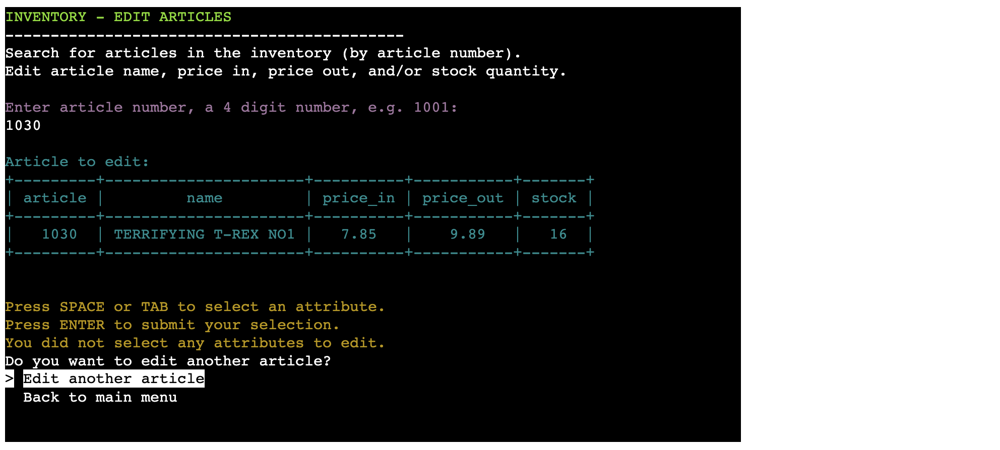
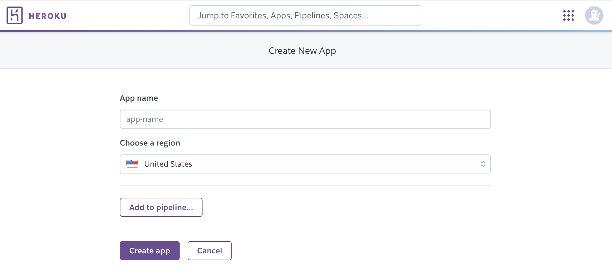

# Shop Register


Shop Register is a Python terminal project simulating a simple inventory and order management system for a fictive toy shop.

The Shop Register program allows its users to display inventory data, add new articles to the inventory, edit existing articles, and delete articles (moving them to a separate worksheet). 

The program also allows its users to display order history data, as well as to register a new order.

The intended users of the program are the shop's owner/employees.

The inventory, order history, and inactive articles data is hosted in a Google Spreadsheet, which is connected to the program.

Link to [Shop Register](https://shop-register-ce8149331475.herokuapp.com/)

Link to the [spreadsheet hosting the data](https://docs.google.com/spreadsheets/d/1l5ltxH_z8xA3u476ee2l4rZuZOsTOB6hkCA9jZtMG6U/edit?usp=sharing).

## User stories

## Features

The program features a main menu, from where the two main parts of the program can be reached, *Inventory* and *Sales*. From the main menu, the user can also choose to quit the program.

The *Inventory* part of the program features the Inventory menu, from which the user can take different paths relating to the shop's inventory.
1. __Display inventory__ (Path to display the shop's full inventory)
2. __Look up article__ (Path to search for and display a single article in the inventory, by its article number)
3. __Add article__ (Path to add a new article into the inventory)
4. __Edit article__ (Path to edit one or more attributes of an article)
5. __Delete article__ (Path to delete an article from the inventory, and instead add it to the *inactive articles* sheet)
6. __Back to main menu__ (Leads back to the main menu)

The *Sales* part of the program features the Sales menu. From here the user can reach all paths the program offers relating to the shop's sales/orders.

1. __Display orders (by date)__ (Path to display orders registered between a start date and an end date chosen by the user)
2. __Look up order by ID__ (Path to search for and display a specific order by its order ID/order number)
3. __Register an order__ (Path to register a new order with a unique order ID, and one row per article in the order. Will also adjust the stock quantity in the inventory to account for the sold articles)
4. __Back to main menu__ (Leads back to the main menu)

At the end of each path the user will be offered to go back to the main menu.


__Click the dropdowns below to see more detailed descriptions of each feature:__


<details>
<summary>Program start and the main menu (click to open)</summary>

### Program start, main menu:

Once the program starts, it will print a welcome message with a brief introduction, before printing the main menu.

There is also a short instruction on how to use the terminal menu.

The main menu has 3 options:

  1. Inventory: This option opens the inventory menu
  2. Sales: This option opens the sales menu
  3. Quit: This option will print a "quit" message and quit the program.


</details>

<br>

<details>
<summary>Inventory menu (click to open)</summary>

### Inventory menu:
If the user chooses the option "1. Inventory" in the main menu, the terminal will be cleared and the inventory menu will be printed.

Similarly to the main menu, there is a short instruction for how to use the terminal menu.

The user has 6 options to choose from:

  1. Display inventory
  2. Look up article
  3. Add article
  4. Edit article
  5. Delete article
  6. Back to main menu


</details>

<details>
<summary>Display inventory (click to open)</summary>

#### Display inventory
Option 1 in the inventory menu will start the path "Display inventory".

The terminal is cleared. Then a message is printed containing a title "Inventory - Displaying full inventory", to clarify for the user, with a short explanation below.

Then a table is printed of the shop's full inventory. This table contains the headers and all rows from the inventory worksheet in the connected Google Spreadsheet.


After the table with the shops inventory, a terminal menu with only one choice is printed ("Go back"). The user can press enter to go back to the main menu once they are finished reviewing the table.


</details>

<details>
<summary>Look up article (click to open)</summary>

#### Look up article
The 2nd choice in the inventory menu, "2. Look up article", will start the look up article path. 

The title of the path, "Inventory - Look up articles" is printed, followed by a short explanation.

After this, the user is asked to enter a 4-digit article number. 
Upon providing a valid article number, that exists in the inventory, a table will be printed containing the details for that specific article. 


If the article number entered is of a valid format, but is not found in the inventory, a message will instead be printed, informing the user.


After either displaying the found article, or informing the user of the article not existing in the inventory, the user will get 2 choices in a terminal menu:
  1. Look up another article - This choice will restart the look up article-path
  2. Back to main menu - This choice will take the user back to the main menu

</details>

<details>
<summary>Add article (click to open)</summary>

#### Add article
The 3rd option in the inventory menu leads the user into the "add article path". 

Similarly to the other options, a title and short explanation is printed.

The user is then asked to enter an article number. If the article number is valid, and available, meaning it has not been used before, the creation of a new article will start.

A table for an article is printed, with the article number chosen by the user, and the other values showing as empty.

The user will be asked to enter a name for the article, price in (the price the company pays for the article), price out (the price at which the company sells the article), and the stock quantity.

After each successful input, the table is printed again. This is meant to help the user see their progress in creating the article.


Below is the table once only the stock quantity remains to be entered. Once the quantity is entered, the table is printed one last time, showing the finished article.

Below is a message confirming the article was successfully added to the inventory.


In the add article path, if the user enters an article number that already exists in the inventory, the user will get the option to edit the article instead.

If the user selects "Yes" in this terminal menu, they will be routed to the edit article path.


In the add article path, if the user enters an article number which is not in the inventory, but has been used before and is now part of the "inactive articles" (meaning it has been deleted), the user will be informed with a message printed to the terminal, and asked if they want to add a different article, or go back to main menu.

Article numbers may not be reused once they have been deleted. The reason is that this could lead to misleading data in the shop's order history.


</details>

<details>
<summary>Edit article (click to open)</summary>

#### Edit article
The 4th option in the inventory menu starts the "Edit articles" path.

The title of the path is printed together with a short explanation. In this path, the user can edit one or more attributes of an article. 

First, the user is asked for the article number of the article that they wish to edit.

If the article is found in the inventory, a table with the article details will be printed to the terminal, and the user will be prompted to confirm that they would like to edit the article.


If the user selects "No", they will be asked if they want to edit another article, or go back to the main menu. If they select "Yes", a multi-selection menu will be printed, in which the user can choose which attribute(s) they would like to edit.

The user can move the selector in the menu with the up and down arrows on their keyboard. To select an item the user can press \<space> and to submit their selection they can press \<enter>. 


If the user presses \<enter> without marking any of the options with \<tab> or \<space>, is equivalent to making an empty selection, meaning the user does not want to make any edits.


If the user selects one or more attributes before pressing \<enter>, the user will be asked to input new values for the selected attributes. Upon valid input, they will get a message confirming that the article value has been updated.


In the "edit article" path, if the user entered an article number of a valid format, but the article number does not exist in the inventory, the user will be informed by a print message.


Lastly, the user will be asked if they want to edit another article or go back to the main menu.

</details>

<details>
<summary>Delete article (click to open)</summary>

#### Delete article
The "delete article" path, which is the 5th option in the inventory menu, lets the user remove articles from the inventory, and instead add them to a separate worksheet, "Inactive articles".

After the title of the path, and the short explanation, are printed, the user is asked for the article number of the article they would like to remove.

If the user enters an article number that exists in the inventory, the article details are printed in a table. Then the user is asked to confirm if they would like to remove the article. 


If the user confirms they want to remove the article, the article is removed from the inventory. The article will instead be added to the "Inactive articles" worksheet. 

A message is printed to the terminal to confirm the deletion to the user.

After this, the user is asked if they want to delete another article, or go back to the main menu.


In the "delete article" path, if the user enters an article number with a valid format, but the article does not exist in the inventory, the user gets informed by a printed message. 


</details>

<br>

<details>
<summary>Sales menu (click to open)</summary>

### Sales menu
The sales menu can be reached from the main menu (by selecting "2. Sales").

The terminal is cleared and the sales menu is printed.

Similarly to the main and inventory menus, there is a short instruction for how to use the terminal menu.

The user has 4 options to choose from:

  1. Display orders (by date)
  2. Look up order by ID
  3. Register an order
  4. Back to main menu


</details>

<details>
<summary>Display orders (by date) (click to open)</summary>

#### Display orders (by date)
The 1st option in the sales menu leads the user into the "display order history" path. 

The title of the path is printed, as well as a short explanation informing the user that they can display orders registered within a certain date range.

The user will then be prompted for a start date and an end date. 


Once the user has inputted a valid start and end date, any orders registered between the two dates will be printed in a table. 


If there are no orders in the order history worksheet registered within the date range provided by the user, a message will be printed informing the user.


In both scenarios, the user is asked if they want to look at another time period of order history data or go back to the main menu.

</details>

<details>
<summary>Look up order by ID (Click to open)</summary>

#### Look up order by ID
The 2nd option in the sales menu is to look up orders by ID. In this path, the user can search for an order by providing an order ID/order number. 

If the order is found in the order history, the complete order will be printed in a table. 

The user is then asked if they would like to look up another order or go back to the main menu.


If an order ID of valid format is entered, and this ID is not found in the order history, the user is informed by a print message. 


</details>

<details>
<summary>Register an order (click to open)</summary>

#### Register an order
The 3rd option in the sales menu is to "register an order". This option lets the user build an order, and then register it in the system. The stock quantity of the articles in the order will decrease in the inventory by the sold quantity.

In line with all other paths, a title and a short explanation is printed. 

The order number will be automatically generated. It will be the last order number +1. 
The sales date will also be automatically set to the current date.

The user will be asked to input which article they want to add to the order, by entering the article number.

If the article exists in the inventory, and has a stock quantity larger than 0, the user will be asked to enter the quantity they want to sell.

In the prompt, the user is informed of the current stock quantity of the specific article. They will not be allowed to enter a sales quantity that is larger than the current stock quantity.

Each article will have its own row in the order, so upon entering a valid article number and sales quantity, the user is asked if they would like to enter more rows to the order, or if the order is complete.


Once all rows of the order has been added (all article numbers and their quantities in the order), the user will select "Order is complete".

A summary of the order will then be printed in a table. Below the user will be asked to finalize the order.


If the user chooses to finalize the order, the order rows will be registered in the order history table. The stock quantities of the articles in the order are adjusted to account for the sold items. Lastly, a message is printed to the user confirming the order was registered.

If the user instead chooses to cancel the order at this stage, no changes will have been made to the spreadsheet.


</details>

<br>

<details>
<summary>Quitting the program (click to open)</summary>

### Quitting the program

The user can choose to quit the program from the main menu. A message is then printed to the terminal as a confirmation to the user before the program is quit.


</details>

## Input validation

Input validation is present throughout the program. When entering invalid input, the program will print feedback to the user in a red color. 

Example: feedback shown when entering an invalid value for an article number


<details>
<summary>Click to see a description of valid entries in the program</summary>

### Valid entries
A guide to valid entries in the program:

- __Article number:__ a positive, 4-digit integer, ranging from 1000 - 9999.

- __Article name:__ a string of length 5-34 characters. Has to contain letters. Can contain max one 2-digit number. Can contain special characters "!/./,/-" and spaces. OBS! Superfluous spaces will be removed so that there are no trailing spaces and only one space in between words. The resulting string is validated. 

- __Price in:__ a positive, decimal number, below or equal to 99999.99.

- __Price out:__ same as "price in". If "price out" is smaller than "price in" the user will be asked to confirm, since this would mean the shop is selling the item at a loss.

- __Quantity:__ a positive integer, below or equal to 999999.

- __Sales quantity:__ same as quantity, but will also need to be equal to or smaller than the stock quantity of the specific article (the shop cannot sell items that they do not have in stock).

- __Order number/ID:__ a positive, 5-digit integer, ranging from 10000 - 99999.

- __Start date:__ stripped of trailing spaces, it is in the format YYYY-MM-DD. The string can be parsed into a date. The date is not greater than the current date (since dates are inputted to view historic data, no dates that have not yet occurred will be accepted).

- __End date:__ same as start date, but has to be either the same date as the start date, or a date that is greater than the start date.

</details>

## Improve user-friendliness
To make the program more user-friendly, third party packages Colorama, Simple terminal menu, and PrettyTable were used. 

- __Colorama:__ used to change the text colour in the terminal, according to the following schema:
  - Light green: Titles 
  - Light magenta: Input
  - Red: Invalid input feedback
  - Yellow: warning/attention
  - Light cyan: Tables
  - Green: Success messages

<br>

- __PrettyTable:__ used to easily print data in a more readable table format.

- __Simple terminal menu:__ used to improve navigation through the program, with simple-to-use terminal menus. 

Print statements are used throughout the program to provide users with instruction and feedback.

The standard library module *os* (`os.system("clear")`) is used where it makes sense, to clear the terminal for the user, in order to remove distractions and clutter.


## Instructions

## Flowcharts
Overarching:


Inventory:


Sales:


## Code

The program is written in Python 3.12.1 and split into 7 different files implementing object-orientated programming and best practices to enhance the modularity and readability of the project.

Each file deals with different aspects of the program and are listed below as such:

 1. **run.py**: The run.py file acts as the main file of the program. It is required to start the program and through the implementation of switch statements, calls all the other functionality from the rest of the files.

    <details>
      <summary>run.py Code Summary</summary>

      <br>

      **Code Summary:**

      - `back_to_main_menu()`: Function that clears the terminal and opens the main menu.
      - `lookup_article_end_menu()`: A function that uses simple-term-menu to display 2 options, one to go back to main menu and the other to look up another article.
      - `add_article_end_menu()`: Defines a function that uses simple-term-menu to add another article or go back to the main menu.
      - `edit_article_end_menu()`: Function that uses simple-term-menu to display two options, one to edit another article and the other will clear the terminal and open the main menu.
      - `delete_article_end_menu()`: A function that uses simple-term-menu to display two options, one to delete another article, the other will clear the terminal and go back to the main menu.
      - `register_order_end_menu()`: Defines a function that uses simple-term-menu to display two options, one to register another order, the other will clear the terminal and go back to the main menu.
      - `display_orders_by_date_end_menu()`: Function that uses simple-term-menu to display two options, one to search for different dates, the other will clear the terminal and return back to main menu.
      - `lookup_order_end_menu()`: A function that uses simple-term-menu to display two options, one to search for a different order and the other will clear the terminal and return back to the main menu.
      - `sales_menu()`: Defines a function that uses simple-term-menu to display four options of the sales menu:
          - Display orders (by date)
          - Look up order by ID
          - Register an order
          - Back to main menu
      - `inventory_menu()`: Defines a function that uses the simple-term-menu to display the 6 options of the inventory menu:
        - Display inventory
        - Look up article
        - Add article
        - Edit article
        - Delete article
        - Back to main menu
      - `main_menu()`: A function that uses simple-term-menu to display the three options of the main menu. The inventory menu, the sales menu or to quit the program. If the first two are selected then they will be redirected to the menus above, if "Quit" is selected the program will exit gracefully.
      - `main()`: Defines a function which uses simple-term-menu to display a welcome message and call main_menu() function to begin the application flow.
      - `if __name__ == "__main__":` Is called to check the file is run when called directly and not when imported as a module.
    
     <br>

     **Summary of functionality in `run.py`:**

      - Description: The `run.py` file is responsible for implementing the "menu" side of the logic for the program, this is where the displaying of the options is handled.
    
     <br>

    </details>

    <br>
    

 2. **validators.py**: The validators.py file defines the Validators class, this is responsible for managing the validating functions uses in the rest of the application.

    <details>
      <summary>validators.py Summary</summary>

      <br>
      
      **Code Summary:**

      - `validate_not_empty(data)`: Defines a function to check an input data, if data is not empty it returns True, else it returns False.
      - `validate_is_positive(data)`: A function to check that the input data is a positive float, if it is positive it returns True else it returns False.
      - `validate_is_int(data)`: Defines a function to check if input data is an integer, if it is an integer it returns True, else it returns False.
      - `validate_is_float(data)`: A function that given an input data checks if it is a float, if it is a float then it returns True else it returns False.
      - `validate_price(data)`: Function that checks given an input data that it is not empty and it is a float and it is positive returns True otherwise it returns False.
      - `validate_quantity(data)`:A function that given an input data checks if the input is not empty and it is an integer and it is a positive integer, if these conditions are met then it returns True, else it returns False.
      - `validate_article_number(data)`: Defines a function given an input data that if the input is a positive integer and is higher than 1000 and lower than 9999 returns True else it returns False.
      - `validate_article_exists(article_number, sheet)`: Function that given an article_number and a sheet returns True if the article number is found in the sheet, else it returns False.
      - `validate_is_name(data)`: Defines a function to check given an input data that it is not empty and it is larger than 5 characters and lower than 34 characters, if conditions are met it returns True else it returns False.
      - `validate_is_date(date_str)`: Defines a function which given an input date_str uses regex to check that it is in an appropriate date format, if so it returns True else it returns False.
      - `validate_order_number(data)`: A function that given an input data checks to see if the input is a positive integer lower than 99999 and higher than 10000 it returns True, otherwise it returns False.
     <br>
  
      **Summary of functionality in `validators.py`:**

      - Description: The validators.py file is responsible for running functions which will validate the inputs given by the user, whether it is numbers or names, all have to be validated before they can be accepted by the program for further processing. 
    
     <br>
  
      </details>

      <br>

 3. **helpers.py**: The helpers.py file defines three functions which help in the displaying of the data from google sheets to the terminal

    <details>
     <summary>helpers.py Summary</summary>

      <br>

      **Code Summary:**

     - `add_row(row, sheet)`: Defines a function which given a google sheet and a row in list format, appends that row to the bottom of the sheet
     - `display_full_sheet(sheet)`: A function which separates the headers and data from a sheet and passes it to be displayed in display_data
     - `display_data(headers, rows)`:A function which given 2 lists, "headers" and "rows" uses the preetytable python package to display them in tabular format to the terminal.

  
     <br>

     **Summary of functionality in `helpers.py`:**

     - Description: A file with functions responsible for appending a row to a sheet and for displaying the data in a sheet in tabular format to the terminal.
    
     <br>

     </details>

     <br>


 4. **get_sales_quantity.py**: The get_sales_quantity.py file defines a function which takes care of the logic around getting a sales quantity when a sales order is being constructed.

    <details>
     <summary>get_sales_quantity.py Summary</summary>

     <br>

      **Code Summary:**

     - `get_sales_quantity(sheet, article_number, order)`: A function given the sheet, article_number and order amount will return an integer displaying the real amount of stock left that can be ordered.

     <br>

      **Summary of functionality in `get_sales_quantity.py`:**

     - Description: This function is necessary due to when building a sales order one can order 5 of stock X and given that stock X is represented in the sheet as having 10 that should be possible, however the changes in the sheet are only made when the order is finalized but the second order in our order flow could be that 6 of stock X are also ordered, since we already used 5 to fulfill the first order another 6 stock should not be possible. That is the purpose of this function, to keep track of the amount of a specific stock that has been ordered and to make sure that someone cannot order more than is available.
    
     <br>

     </details>

     <br>

 5. **get_user_input.py**: The get_user_input.py file defines a function which takes care of the logic around getting a sales quantity when a sales order is being constructed.

    <details>
     <summary>get_user_input.py Summary</summary>

     <br>

      **Code Summary:**

     - `get_quantity()`: A function that runs a while loop to get a valid quantity from the user, if quantity is valid it returns that quantity.
     - `get_price(type)`: Function that runs a while loop to get price input from the user, fi the price is valid it returns the price.
     - `get_article_number()`: Defines a function that runs a while loop to get a article number from the user, if the article number is valid it breaks the loop and returns the article number
     - `get_order_id()`: A function that runs a while loop to get an order ID from a user, if the order ID is valid it breaks the loop and returns that order ID.
     - `get_article_name()`: Function that runs a while loop to get an article name from a user, if the name is valid it breaks the loop and returns that article name.
     - `get_date(type)`: Defines a function given a type that runs a while loop to get a date from the user, if the date is valid it breaks the while loop and returns the date.
     - `confirm_user_entry(user_entry)`: A function which is given a user input and presents the user with an option to reconfirm or cancel their selection.
     - `confirm_order_complete()`: Function which asks the user if they wish to add another row to their order or complete the order, returns False if user wishes to continue and True if they wish to complete order.
     - `confirm_order_final()`: Defines a function which asks the user if they wish to finalize their order, returns True if the user wishes to finalize order otherwise returning False.
     <br>

      **Summary of functionality in `get_user_input.py`:**

     - Description: The functions in the file are responsible for asking the user for different types of inputs, whether these are about strings or integers or dates. The last three functions are also responsible for asking the user to re-confirms their choice, this can be important when finalizing a large order or confirming a large input.
    
     <br>

     </details>

     <br>

 6. **articles.py**: The articles.py file defines the Articles class, this is responsible for creating the articles and managing the input functions.

    <details>
     <summary>articles.py Summary</summary>

     <br>

      **Code Summary:**

     - `__init__(self, article, article_name, price_in, price_out, article_quantity)`: A function that is responsible for initializing an Articles object with the following variables.
     - `to_row()`: Function that returns the data of the object to a list format when called.
     - `get_row_for_article(inventory, article_number)`: Defines a function given a google sheet and an article number, retrieves a row of information for a specific article from the
        inventory google sheet.
     - `remove_row(article_number, sheet)`: A function that given an article_number and google sheet removes that specific row from the google sheet where the article_number exists.
     - `get_row_index_for_article(article_number, sheet)`: Function that given an article_number and google sheet, retrieves the index number of the row for the specific article_number on the google sheet.
     - `look_up_article(inventory)`: Defines a function that given an inventory sheet will ask the user for an article number and display the data for that article number from the sheet.
     - `edit_article(inventory, article)`: A function that given an inventory and article number will display the data for the article number and ask what data in the specific article the user would like to edit.
     - `edit_menu(article, inventory)`: Function which given the article and inventory sheet asks the user which attributes they would like to edit and displays the edited information back to them.
     - `delete_article(inventory, inactive_articles)`: Defines a function which given the inventory sheet and the inactive inventory sheet removes the article from the inventory sheet and then appends it into the next free row of the inactive inventory sheet.
     - `build_article(inventory, inactive_articles)`: Defines a function which given the inventory sheet and the inactive inventory sheet builds the data in list format to be appended in the inventory sheet. It requires the inactive inventory sheet to check that the inventory item being added in did not previously exist, thus inheriting the sales of a previous inventory item.
     <br>

      **Summary of functionality in `articles.py`:**

     - Description: The functions in the file are responsible for performing C.R.U.D. (Create, Read, Update, Delete) on the article items. This is the backbone of any inventory system as we need the functionality to add new inventory, edit the existing inventory through sales or discounts, display our inventory to the user and also delete the inventory but without loosing the deleted data.
    
     <br>

     </details>

     <br>

 7. **orders.py**: The orders.py file defines the Orders class, this is responsible for creating the sales orders and managing the input functions.

    <details>
     <summary>orders.py Summary</summary>

     <br>

      **Code Summary:**

     - `__init__(self,order_number, article_number, quantity, sum)`: A function that is responsible for initializing an Orders object with the following variables.
     - `to_row()`: Function that returns the data of the object to a list format when called.
     - `get_first_row_index_for_date(date_str, sheet)`: Defines a function given a google sheet and a date in string format to retrieve the row index where the date shows up.
     - `get_last_row_index_for_date(date_str, sheet)`: A function that given a google sheet and a date in string format to return the last row index where the date shows up.
     - `get_order_rows_for_dates(orders, start_index, end_index)`: Function that given an orders google sheet, a start row index and an end row index retrieves order rows within a specified range from the orders sheet.
     - `generate_order_id(orders)`: Defines a function that given an orders sheet generates a new order ID based on the greatest orderID already used and returns that orderID
     - `display_orders_by_date(orders)`: A function that given an orders google sheet will ask the user for "from date" and "to date" inputs and then given that the dates are valid and data exists will display that data.
     - `lookup_order_by_id(orders)`: Function which given an orders google sheet will ask the user for an order id and if the id is valid and data exists will display the data for that specific sales order.
     - `build_order(order_id, orders, inventory)`: Defines a function which given an order id the orders sheet and the inventory sheet builds the data in list format to be appended in the orders sheet. It requires the  inventory sheet to check that the sales order item being added exists in inventory.
     <br>

      **Summary of functionality in `orders.py`:**

     - Description: The functions in the file are responsible for performing C.R. (Create, Read) on the sales order items. This is the other backbone of any inventory system as we need the functionality to add new sales orders and display our inventory to the user. The sales order is important for keeping track of what inventory was sold, not being able to update or delete these records is also very important as sales should not be removed or updated after the fact. If a stock item is deleted from the inventory sheet, its sales will not be removed from the orders sheet.
    
     <br>

     </details>

## Technologies used
### Languages:

- [Python 3.12.1](https://www.python.org/downloads/release/python-385/): used to write the application logic

- [JavaScript](https://www.javascript.com/): was provided as part of the template for the project.

- [HTML](https://developer.mozilla.org/en-US/docs/Web/HTML): was provided as part of the template for the project.

### Frameworks/Libraries, Programmes and Tools:
#### Python modules/packages:

##### Standard library imports:

- [os](https://docs.python.org/3/library/os.html): was used to clear the terminal, to provide a better user experience.
- [re](https://docs.python.org/3/library/re.html): was used to write regex expressions for validation of data formats.
- [sys](https://docs.python.org/3/library/sys.html): was used to call sys.exit() when quitting program.
- [datetime](https://docs.python.org/3/library/datetime.html): was used to generate the current date, as well as for validation of inputted dates

##### Third-party imports:

- [gspread](https://pypi.org/project/gspread/): was used to connect, create, read, update and delete data in a Google Sheet
- [google-auth](https://pypi.org/project/google-auth/): was used to authenticate access to Google Sheet from the application
- [Simple Terminal Menu](https://pypi.org/project/simple-term-menu/): was used to implement all menus in the program.
- [Colorama](https://pypi.org/project/colorama/): was used to add colors to the program.
- [PrettyTable](https://pypi.org/project/prettytable/): was used to print data in a table format in the application.


#### Other tools:

- [VSCode](https://code.visualstudio.com/): was used as the IDE.
- [Git](https://git-scm.com/): was used for version control.
- [GitHub](https://github.com/): was used to host the code of the website.
- [Draw.io](https://www.drawio.com/): was used to make flowcharts of the application.
- [Heroku.com](https://id.heroku.com/login): was used to deploy the project.
- [Google Sheets](https://www.google.com/sheets/about/): was used to store the data.
- [Regex Generator](https://regex-generator.olafneumann.org/): was used to generate regex for input validation of article names

## Deployment
The program was deployed to [Heroku](https://id.heroku.com/login) and can be accessed by this [link](https://shop-register-ce8149331475.herokuapp.com/).

### To run the application locally:

*Note:*
1. This project requires you to have Python 3 installed on your computer.

2. In order to run the project you will need to install and run [virtualenv](https://packaging.python.org/en/latest/guides/installing-using-pip-and-virtual-environments/). This is due to compatibility issues between some versions of Python, such as 3.9.6 and the version of Python run on Heroku.

Create a local copy of the GitHub repository by following one of the two processes below:

- Download ZIP file:
  1. Go to the [GitHub Repository](https://github.com/johannacarolinep/shop-register).
  2. Download the ZIP file containing the project.
  3. Extract the ZIP file to a location on your computer.

- Clone the repository:
  1. Run the following command in a terminal
  - `git clone git@github.com:johannacarolinep/shop-register.git`

### Run the project as a remote web application by deploying to Heroku:

- Clone the repository:
  1. Open the terminal on your computer.
  2. Run the command
  - `git clone git@github.com:johannacarolinep/shop-register.git`

  3. Create your own GitHub repository to host the code. You will need to host this code on your repository for the following to work.
  4. Run the command `git remote set-url origin <Your GitHub Repo Path>` to set the remote repository location to your repository.

  5. Push the files to your repository with the following command:
  `git push`
  
  6. Create a Heroku account if you don't already have one here [Heroku](https://dashboard.heroku.com).
  7. Create a new Heroku application on the [Heroku Apps page](https://dashboard.heroku.com/apps), by clicking "New" in the upper right corner, and selecting "Create new app":

    

8. Name the app, choose a region, and click "Create app".
    

9. Go to the Deploy tab:
    

10. In the "Deployment method" section, click on "GitHub - Connect to Github". Search for your repository and connect your application.
    

  11. Next, go to the Settings tab:
  

  12. In the "Buildpacks" section, click "Add buildpack". Then add "python" and "nodejs", in that order (OBS! The order is important.) 
  

  

  

  13. Next, in the "Config Vars" section, click "Click "Reveal Config Vars". You will need to add 2 Config Vars
  

- Config Var number 1:
    - Key: PORT Value: 8000 
    - This Config Var was provided by [CODE INSTITUTE](https://codeinstitute.net/)

- Config Var number 2:
    - Key: CREDS Value: (Reach out for this value)
    - This Config Var contains the credentials necessary for accessing the Google Sheet linked to the program.
    

  14. Go back to the Deploy tab:

      

  17. In the "Manual deploy" section, click "Deploy Branch":

      

      - Wait for the completion of the deployment.

      

  18. You can now click the "View" button (in the screenshot above), to launch the application.


## Testing
All test-related documentation can be found in [TESTING.md](TESTING.md).

## Bugs
### Solved bugs
#### Error when inputting a date range for which there were no orders to display, in *Display order history by date* path

<details>
<summary>See issue description and solution</summary>

__Issue:__ An error would occur after inputting the START date and END date on the *Display order history by date* path, or in the method `display_orders_by_date()` in orders.py.

Looking closer at the method and following the logic step by step, I understood that the error occurred when the inputted dates did not have exact matches in the dates in the order history. 

After getting the dates (as strings) from the user, they would be passed to another method, `get_row_index_for_date()`. This method would get the order dates from the orders sheet, then iterate through the order dates looking for a match to the dates provided by the user. If found, the index of the matched date would be returned and stored in the variable `index`.  However, if there was no match for the provided date amongst the order dates, the `index` variable would be undefined, leading to an error further down.

__Fix:__ First, I implemented code in the `display_orders_by_date()` method to check through a for loop if there are any orders in the order history data with dates between the user-provided START and END date. An if statement controls the flow so that the method that checks for the index of the dates is only called once I know there are orders registered between the two dates. If not, the user is informed with a print statement that there were no orders to display.

```py
        registered_dates = orders.col_values(2)
        registered_dates.pop(0)
        data_exists = False
        for reg_date in registered_dates:
            if reg_date >= start_date and reg_date <= end_date:
                data_exists = True
        if data_exists:
            # get the indexes of the order rows matching user dates
        else:
            # inform user there are no orders to display
```

Next, I needed to change `get_row_index_for_date()`. Instead of iterating the order dates and looking for an exact match for the user-provided date, for my start index, I needed to iterate the order dates and find the index of the __first__ row with an order date that __either matches or is greater than__ the user-provided start date. Similarly, for my end index, I needed to find the __last__ row that __either matches or is smaller than__ the user-provided end date. To achieve this, I used two separate methods, `get_first_row_index_for_date()` and `get_last_row_index_for_date()`.

Here are the new orders being called from inside the if statement in the snippet above:

```py
            # if orders in the date range, gets the data from orders sheet
            start_index = Orders.get_first_row_index_for_date(
                start_date,
                orders,
            )
            end_index = Orders.get_last_row_index_for_date(end_date, orders)
```

The two methods will iterate the order dates from the orders sheet and return the index of the first row on/following the start date and the last row on/before the end date.

```py
    @classmethod
    def get_first_row_index_for_date(self, date_str, sheet):
        column = sheet.col_values(2)
        column.pop(0)
        for item in column:
            if item >= date_str:
                date_str = item
                break
        index = column.index(date_str) + 2
        return index

    @classmethod
    def get_last_row_index_for_date(self, date_str, sheet):
        column = sheet.col_values(2)
        column.pop(0)
        for item in column:
            if item <= date_str:
                temp_date = item
        index = len(column) - 1 - column[::-1].index(temp_date)
        return index + 2
```

Lastly, I confirmed the methods were now working as intended by testing them with numerous different values for START dates and END dates and comparing the resulting print of orders to the orders data in the sheet.

</details>

<br>

#### Issue when trying to build an order row for an article with 0 items in stock, in the *Register order* path

<details>
<summary>See issue description and solution</summary>

__Issue:__ In the method `build_order` in orders.py, there is a while loop that continues until the order is complete, `order_complete = True`. In the while loop, the user will first be asked to input an article number. If the article number exists in the inventory, the user is asked for the sales quantity. While testing the program, I came across an issue, where even if the article number belongs to an article that currently has 0 items in stock, the user will still be asked for a sales quantity. 

This is a problem since the validation for quantities in the program will not accept "0" as a value, and the validation for sales quantities in the program will not accept values that are greater than the stock quantity (the logic being that the shop cannot sell items that they do not have in stock).

This means the user gets stuck, with no way to provide a valid input value in this scenario.

__Fix:__ In the `build_order()` method, the `get_sales_quantity()` function is called to get the input from the user and return it to the variable `sales_quantity`.

In `get_sales_quantity()`, before the user is asked for input, the current stock quantity of the article is read from the inventory sheet.

My solution started with adding an if statement in `get_sales_quantity` after the stock quantity of the article is read. If the stock quantity is 0, I chose to return 0, instead of asking the user for input. 

```py
# check if stock_quantity is 0
    if stock_quantity == 0:
        return 0
```

Then, in `build_order()`, I added another if statement, after calling `get_sales_quantity()`. If the return, sales_quantity, is 0, the user gets informed there are no items of the article in stock. `confirm_order_complete()` is called, so that the user can choose if they want to add another row to the order, or if the order should be considered as complete. After this, I added `continue` to skip the rest of the current iteration of the while loop. 

```py
# if stock quantity is 0, get_sales_quantity returns 0
                if sales_quantity == 0:
                    print(
                        Fore.YELLOW
                        + f"No items of article {article_number} in stock."
                        + Style.RESET_ALL,
                    )
                    # ask user if they want to add more rows
                    order_complete = confirm_order_complete()
                    continue
```


</details>

<br>

#### In the *Add article* path, when inputting an article number belonging to an inactive article, the wrong menu was displayed

<details>
<summary>See issue description and solution</summary>

__Issue:__ In the method `build_article()` the user is asked to enter an article number. If the user enters an article number that belongs to an inactive article (the article number exists in the inactive articles sheet), the user is informed through a print statement. After this the *Add article* path end menu should be displayed, allowing the user to either add a different article or to go back to the main menu.

Instead, after the print statement, the end menu for a different path, *Edit article*, was printed, incorrectly directing the user to either the *Edit article* path or back to the main menu.

I troubleshooted the issue by following the logic in the `build_article` method. The method returns a bool, which is then used in an if statement where the method was called, in the `inventory_menu()`, to call the end menu for the *Add article* path if True, and call the end menu for the *Edit article* path if False.

This way I could see that I was unintentionally returning False in this scenario, when I should be returning True.

__Fix:__ My solution was simply to add `return True` after the previously mentioned print statement, as per the snippet below.

```py
        # if article number belongs to an inactive article, print message
        if data_validator.validate_article_exists(article, inactive_articles):
            print(
                Fore.YELLOW
                + f"""Article with ID {article} already exists and is inactive.
Please choose a different article number."""
                + Style.RESET_ALL
            )
            return True
```

Lastly, I tested running the program, entering the article number of an inactive article, to confirm the method was now acting as intended.


</details>


### Unsolved bugs
I am not aware of any unsolved bugs. 


## Credits
- [gspread](https://pypi.org/project/gspread/) and [google-auth](https://pypi.org/project/google-auth/) - connection to Google Sheet
- [Simple Terminal Menu](https://pypi.org/project/simple-term-menu/) - Terminal menus
- [Colorama](https://pypi.org/project/colorama/) - color formatting
- [PrettyTable](https://pypi.org/project/prettytable/) - table printouts

## Acknowledgements
