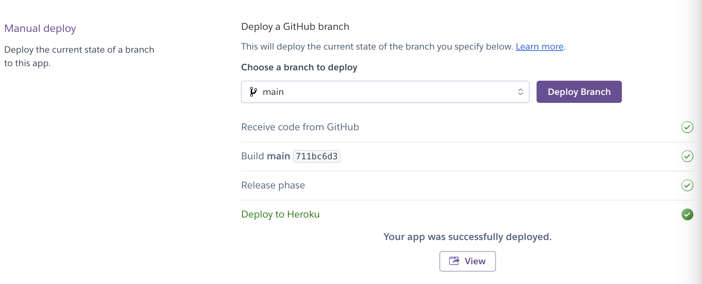

# Shop Register

Shop Register is a Python terminal project simulating a simple inventory and order management system for a fictive toy shop.

The Shop Register program allows its users to display inventory data, add new articles to the inventory, edit existing articles, and delete articles (moving them to a separate worksheet). 

The program also allows its users to display order history data, as well as to register a new order.

The inventory, order history, and inactive articles data is hosted in a Google Spreadsheet, which is connected to the program.

Link to [Shop Register](https://shop-register-ce8149331475.herokuapp.com/)

Link to the [spreadsheet hosting the data](https://docs.google.com/spreadsheets/d/1l5ltxH_z8xA3u476ee2l4rZuZOsTOB6hkCA9jZtMG6U/edit?usp=sharing).

## User stories

## Features
### Program start, main menu:
Once the program starts, it will print a welcome message with a brief introduction, before printing the main menu.

There is also a short instruction on how to use the terminal menu.

The main menu has 3 options:

  1. Inventory: This option opens the inventory menu
  2. Sales: This option opens the sales menu
  3. Quit: This option will print a "quit" message and quit the program.

### Inventory menu:
If the user chooses the option "1. Inventory" in the main menu, the terminal will be cleared and the inventory menu will be printed.

Similarly to the main menu, there is a short instruction for how to use the terminal menu.

The user has 6 options to choose from:

  1. Display inventory
  2. Look up article
  3. Add article
  4. Edit article
  5. Delete article
  6. Back to main menu

#### Display inventory
Option 1 in the inventory menu will start the path "Display inventory".

The terminal is cleared. Then a message is printed containing a title "Inventory - Displaying full inventory", to clarify for the user, with a short explanation below.

Then a table is printed of the shop's full inventory. This table contains the headers and all rows from the inventory worksheet in the connected Google Spreadsheet.

After the table with the shops inventory, a terminal menu with only one choice is printed ("Go back"). The user can press enter to go back to the main menu once they are finished reviewing the table.

#### Look up article
The 2nd choice in the inventory menu, "2. Look up article", will start the look up article path. 

The title of the path, "Inventory - Look up articles" is printed, followed by a short explanation.

After this, the user is asked to enter a 4-digit article number. 
Upon providing a valid article number, that exists in the inventory, a table will be printed containing the details for that specific article. 

If the article number entered is of a valid format, but is not found in the inventory, a message will instead be printed, informing the user.

After either displaying the found article, or informing the user of the article not existing in the inventory, the user will get 2 choices in a terminal menu:
  1. Look up another article - This choice will restart the look up article-path
  2. Back to main menu - This choice will take the user back to the main menu

#### Add article
The 3rd option in the inventory menu leads the user into the "add article path". 

Similarly to the other options, a title and short explanation is printed.

The user is then asked to enter an article number. If the article number is valid, and available, meaning it has not been used before, the creation of a new article will start.

A table for an article is printed, with the article number chosen by the user, and the other values showing as empty.

The user will be asked to enter a name for the article, price in (the price the company pays for the article), price out (the price at which the company sells the article), and the stock quantity.

After each successful input, the table is printed again. This is meant to help the user see their progress in creating the article.

Below is the table once only the stock quantity remains to be entered. Once the quantity is entered, the table is printed one last time, showing the finished article.

Below is a message confirming the article was successfully added to the inventory.

In the add article path, if the user enters an article number that already exists in the inventory, the user will get the option to edit the article instead.

If the user selects "Yes" in this terminal menu, they will be routed to the edit article path.

In the add article path, if the user enters an article number which is not in the inventory, but has been used before and is now part of the "inactive articles" (meaning it has been deleted), the user will be informed with a message printed to the terminal, and asked if they want to add a different article, or go back to main menu.

Article numbers may not be reused once they have been deleted. The reason is that this could lead to misleading data in the shop's order history.

#### Edit article
The 4th option in the inventory menu starts the "Edit articles" path.

The title of the path is printed together with a short explanation. In this path, the user can edit one or more attributes of an article. 

First, the user is asked for the article number of the article that they wish to edit.

If the article is found in the inventory, a table with the article details will be printed to the terminal, and the user will be prompted to confirm that they would like to edit the article.

If the user selects "No", they will be asked if they want to edit another article, or go back to the main menu. If they select "Yes", a multi-selection menu will be printed, in which the user can choose which attribute(s) they would like to edit.

The user can move the selector in the menu with the up and down arrows on their keyboard. To select an item the user can press \<space> and to submit their selection they can press \<enter>. 

If the user presses \<enter> without marking any of the options with \<tab> or \<space>, is equivalent to making an empty selection, meaning the user does not want to make any edits.

If the user selects one or more attributes before pressing \<enter>, the user will be asked to input new values for the selected attributes. Upon valid input, they will get a message confirming that the article value has been updated.

In the "edit article" path, if the user entered an article number of a valid format, but the article number does not exist in the inventory, the user will be informed by a print message.

Lastly, the user will be asked if they want to edit another article or go back to the main menu.

#### Delete article
The "delete article" path, which is the 5th option in the inventory menu, lets the user remove articles from the inventory, and instead add them to a separate worksheet, "Inactive articles".

After the title of the path, and the short explanation, are printed, the user is asked for the article number of the article they would like to remove.

If the user enters an article number that exists in the inventory, the article details are printed in a table. Then the user is asked to confirm if they would like to remove the article. 

If the user confirms they want to remove the article, the article is removed from the inventory. The article will instead be added to the "Inactive articles" worksheet. 

A message is printed to the terminal to confirm the deletion to the user.

After this, the user is asked if they want to delete another article, or go back to the main menu.

In the "delete article" path, if the user enters an article number with a valid format, but the article does not exist in the inventory, the user gets informed by a printed message. 

### Sales menu
The sales menu can be reached from the main menu (by selecting "2. Sales").

The terminal is cleared and the sales menu is printed.

Similarly to the main and inventory menus, there is a short instruction for how to use the terminal menu.

The user has 4 options to choose from:

  1. Display order (by date)
  2. Look up order by ID
  3. Register an order
  4. Back to main menu

#### Display orders (by date)
The 1st option in the sales menu leads the user into the "display order history" path. 

The title of the path is printed, as well as a short explanation informing the user that they can display orders registered within a certain date range.

The user will then be prompted for a start date and an end date. 

Once the user has inputted a valid start and end date, any orders registered between the two dates will be printed in a table. 

If there are no orders in the order history worksheet registered within the date range provided by the user, a message will be printed informing the user.

In both scenarios, the user is asked if they want to look at another time period of order history data or go back to the main menu.

#### Look up order by ID
The 2nd option in the sales menu is to look up orders by ID. In this path, the user can search for an order by providing an order ID/order number. 

If the order is found in the order history, the complete order will be printed in a table. 

The user is then asked if they would like to look up another order or go back to the main menu.

If an order ID of valid format is entered, and this ID is not found in the order history, the user is informed by a print message. 

#### Register an order
The 3rd option in the sales menu is to "register an order". This option lets the user build an order, and then register it in the system. The stock quantity of the articles in the order will decrease in the inventory by the sold quantity.

In line with all other paths, a title and a short explanation is printed. 

The order number will be automatically generated. It will be the last order number +1. 
The sales date will also be automatically set to the current date.

The user will be asked to input which article they want to add to the order, by entering the article number.

If the article exists in the inventory, and has a stock quantity larger than 0, the user will be asked to enter the quantity they want to sell.

In the prompt, the user is informed of the current stock quantity of the specific article. They will not be allowed to enter a sales quantity that is larger than the current stock quantity.

Each article will have its own row in the order, so upon entering a valid article number and sales quantity, the user is asked if they would like to enter more rows to the order, or if the order is complete.

Once all rows of the order has been added (all article numbers and their quantities in the order), the user will select "Order is complete".

A summary of the order will then be printed in a table. Below the user will be asked to finalize the order.

If the user chooses to finalize the order, the order rows will be registered in the order history table. The stock quantities of the articles in the order are adjusted to account for the sold items. Lastly, a message is printed to the user confirming the order was registered.

If the user instead chooses to cancel the order at this stage, no changes will have been made to the spreadsheet.

### Quitting the program

The user can choose to quit the program from the main menu. A message is then printed to the terminal as a confirmation to the user before the program is quit.

## Input validation

Input validation is present throughout the program. When entering invalid input, the program will print feedback to the user in a red color. 

Example: feedback shown when entering an invalid value for an article number

### Valid entries
A guide to valid entries in the program:

- __Article number:__ a positive, 4-digit integer, ranging from 1000 - 9999.

- __Article name:__ a string of length 5-34 characters. Has to contain letters. Can contain max one 2-digit number. Can contain special characters "!/./,/-" and spaces. OBS! Superfluous spaces will be removed so that there are no trailing spaces and only one space in between words. The resulting string is validated. 

- __Price in:__ a positive, decimal number, below or equal to 99999.99.

- __Price out:__ same as "price in". If "price out" is smaller than "price in" the user will be asked to confirm, since this would mean the shop is selling the item at a loss.

- __Quantity:__ a positive integer, below or equal to 999999.

- __Sales quantity:__ same as quantity, but will also need to be equal to or smaller than the stock quantity of the specific article (the shop cannot sell items that they do not have in stock).

- __Order number/ID:__ a positive, 5-digit integer, ranging from 10000 - 99999.

- __Start date:__ stripped of trailing spaces, it is in the format YYYY-MM-DD. The string can be parsed into a date. The date is not greater than the current date (since dates are inputted to view historic data, no dates that have not yet occurred will be accepted).

- __End date:__ same as start date, but has to be either the same date as the start date, or a date that is greater than the start date.

## Improved user-friendliness
To make the program more user-friendly, the packages Colorama, Simple terminal menu, and PrettyTable were used.

- __Colorama:__ used to change the text colour in the terminal, according to the following schema:
  - Light green: Titles 
  - Light magenta: Input
  - Red: Invalid input feedback
  - Yellow: warning/attention
  - Light cyan: Tables
  - Green: Success messages

 

- __PrettyTable:__ used to easily print data in a more readable table format.

- __Simple terminal menu:__ used to improve navigation through the program, with simple-to-use terminal menus. 

## Instructions

## Flowcharts
Overarching:

Inventory:

Sales:

## Technologies used
### Languages:

- [Python 3.12.1](https://www.python.org/downloads/release/python-385/): used to write the application logic

- [JavaScript](https://www.javascript.com/): was provided as part of the template for the project.

- [HTML](https://developer.mozilla.org/en-US/docs/Web/HTML): was provided as part of the template for the project.

### Frameworks/Libraries, Programmes and Tools:
#### Python modules/packages:

##### Standard library imports:

- [os](https://docs.python.org/3/library/os.html): was used to clear the terminal, to provide a better user experience.
- [re](https://docs.python.org/3/library/re.html): was used to write regex expressions for validation of data formats
- [datetime](https://docs.python.org/3/library/datetime.html): was used to generate the current date, as well as for validation of inputted dates

##### Third-party imports:

- [gspread](https://pypi.org/project/gspread/): was used to connect, create, read, update and delete data in a Google Sheet
- [google-auth](https://pypi.org/project/google-auth/): was used to authenticate access to Google Sheet from the application
- [Simple Terminal Menu](https://pypi.org/project/simple-term-menu/): was used to implement all menus in the program.
- [Colorama](https://pypi.org/project/colorama/): was used to add colors to the program.
- [PrettyTable](https://pypi.org/project/prettytable/): was used to print data in a table format in the application.

#### Other tools:

- [VSCode](https://code.visualstudio.com/): was used as the IDE.
- [Git](https://git-scm.com/): was used for version control.
- [GitHub](https://github.com/): was used to host the code of the website.
- [Draw.io](https://www.drawio.com/): was used to make flowcharts of the application.
- [Heroku.com](https://id.heroku.com/login): was used to deploy the project.
- [Google Sheets](https://www.google.com/sheets/about/): was used to store the data.

## Deployment
The program was deployed to [Heroku](https://id.heroku.com/login) and can be accessed by this [link](https://shop-register-ce8149331475.herokuapp.com/).

### To run the application locally:

*Note:*
1. This project requires you to have Python 3 installed on your computer.

2. In order to run the project you will need to install and run [virtualenv](https://packaging.python.org/en/latest/guides/installing-using-pip-and-virtual-environments/). This is due to compatibility issues between some versions of Python, such as 3.9.6 and the version of Python run on Heroku.

Create a local copy of the GitHub repository by following one of the two processes below:

- Download ZIP file:
  1. Go to the [GitHub Repository](https://github.com/johannacarolinep/shop-register).
  2. Download the ZIP file containing the project.
  3. Extract the ZIP file to a location on your computer.

- Clone the repository:
  1. Run the following command in a terminal
  - `git clone git@github.com:johannacarolinep/shop-register.git`

### Run the project as a remote web application by deploying to Heroku:

- Clone the repository:
  1. Open the terminal on your computer.
  2. Run the command
  - `git clone git@github.com:johannacarolinep/shop-register.git`

  3. Create your own GitHub repository to host the code. You will need to host this code on your repository for the following to work.
  4. Run the command `git remote set-url origin <Your GitHub Repo Path>` to set the remote repository location to your repository.

  5. Push the files to your repository with the following command:
  `git push`
  
  6. Create a Heroku account if you don't already have one here [Heroku](https://dashboard.heroku.com).
  7. Create a new Heroku application on the [Heroku Apps page](https://dashboard.heroku.com/apps), by clicking "New" in the upper right corner, and selecting "Create new app":

    

8. Name the app, choose a region, and click "Create app".
    

9. Go to the Deploy tab:
    

10. In the "Deployment method" section, click on "GitHub - Connect to Github". Search for your repository and connect your application.
    

  11. Next, go to the Settings tab:
  

  12. In the "Buildpacks" section, click "Add buildpack". Then add "python" and "nodejs", in that order (OBS! The order is important.) 
  

  

  

  13. Next, in the "Config Vars" section, click "Click "Reveal Config Vars". You will need to add 2 Config Vars
  

- Config Var number 1:
    - Key: PORT Value: 8000 
    - This Config Var was provided by [CODE INSTITUTE](https://codeinstitute.net/)

- Config Var number 2:
    - Key: CREDS Value: (Reach out for this value)
    - This Config Var contains the credentials necessary for accessing the Google Sheet linked to the program.
    

  14. Go back to the Deploy tab:

      

  17. In the "Manual deploy" section, click "Deploy Branch":

      

      - Wait for the completion of the deployment.

      

  18. You can now click the "View" button (in the screenshot above), to launch the application.

## Testing
All test-related documentation can be found in [TESTING.md](TESTING.md).

## Bugs
### Solved bugs
### Unsolved bugs

## Credits
- [gspread](https://pypi.org/project/gspread/) and [google-auth](https://pypi.org/project/google-auth/) - connection to Google Sheet
- [Simple Terminal Menu](https://pypi.org/project/simple-term-menu/) - Terminal menus
- [Colorama](https://pypi.org/project/colorama/) - color formatting
- [PrettyTable](https://pypi.org/project/prettytable/) - table printouts

## Acknowledgements
