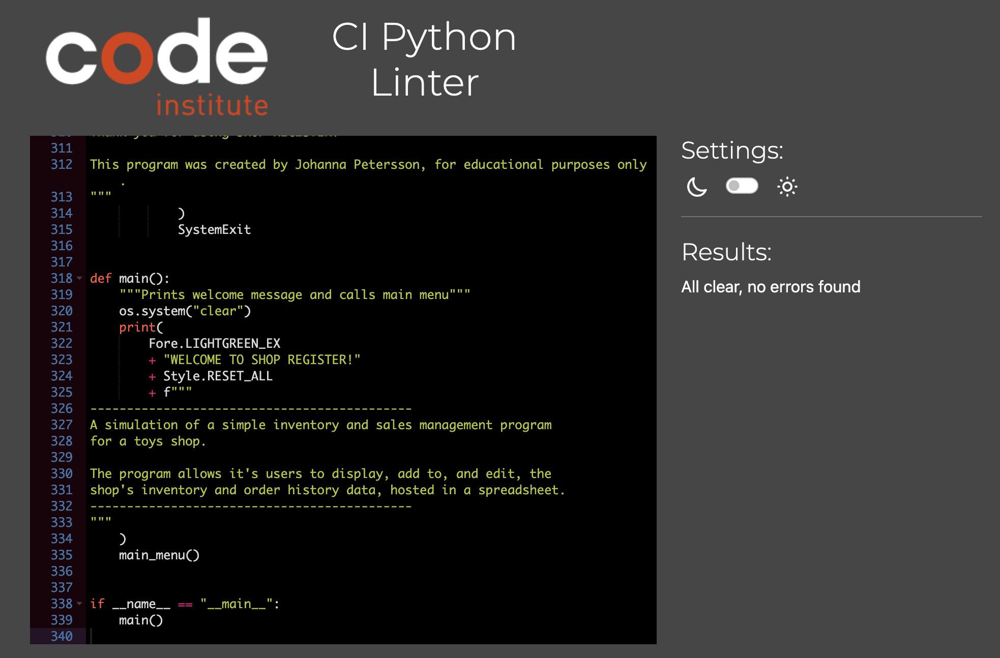
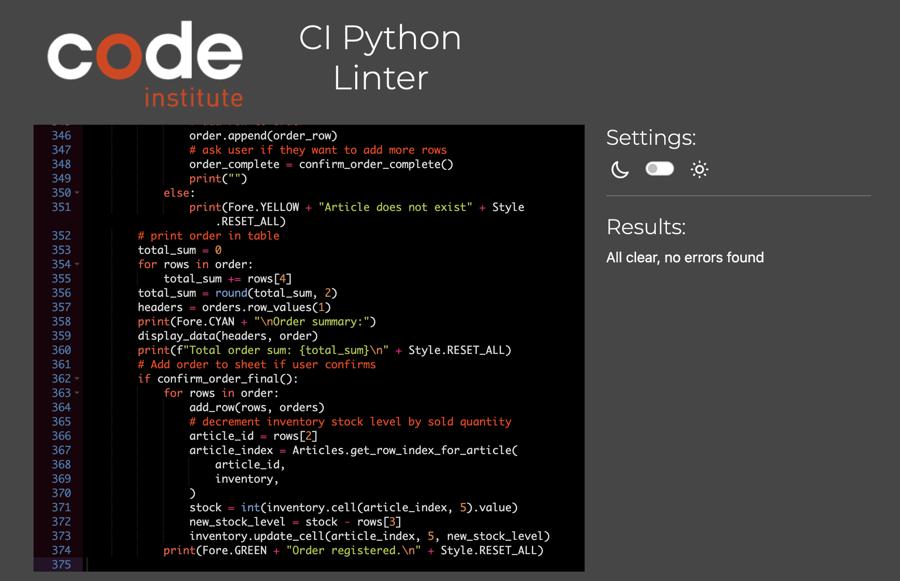
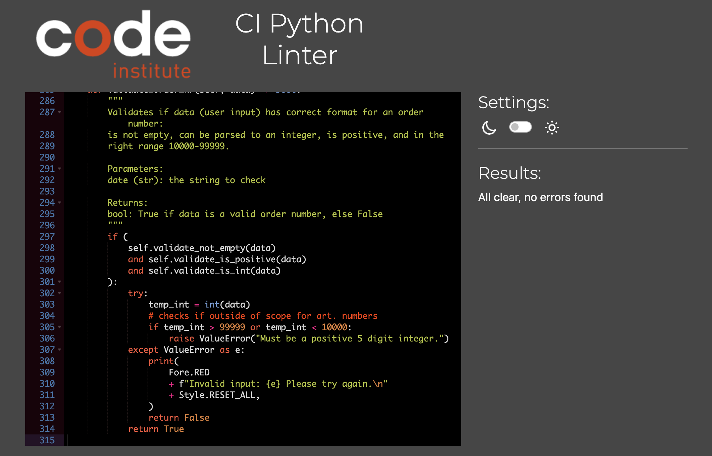
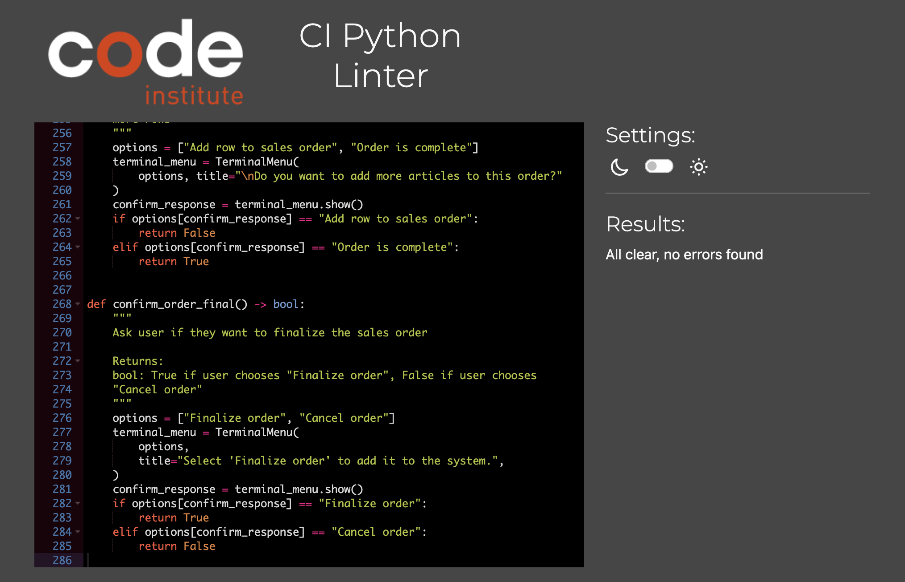
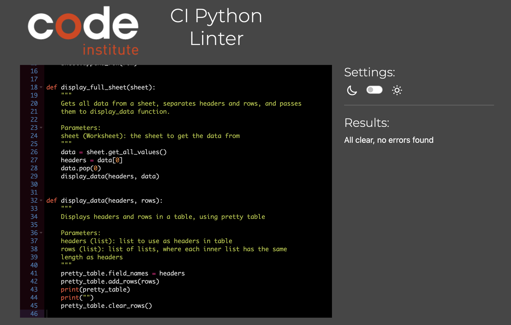

# Testing of Shop Register
## Manual testing

### Testing of the main menus

| __Test case__ | __Action__ | __Expected outcome__ | __Pass?__ | __Comments__ |
| ------------- | -----------| -------------------- | :-------: | ------------ |
| Program start | n/a | Displays welcome message and main menu | Y | - |
| Main menu | Move selector between menu options with up/down arrows | Selector is moved when pressing up and down arrows | Y | - |
|           | Press enter while option "1. Inventory" is selected | The inventory menu displays | Y | - |
|           | Press enter while option "2. Sales" is selected | The sales menu displays | Y | - |
|           | Press enter while option "3. Quit" is selected | The quit message displays and the program is quit | Y | - |
| Inventory menu | Move selector between menu options with up/down arrows | Selector is moved when pressing up and down arrows | Y | - |
|                | Select option *1. Display inventory* | Display inventory path is launched* | Y | - |
|                | Select option *2. Look up article* | *Look up article* path is launched* | Y | - |
|                | Select option *3. Add article* | *Add article* path is launched* | Y | - |
|                | Select option *4. Edit article* | *Edit article* path is launched* | Y | - |
|                | Select option *5. Delete article* | *Delete article* path is launched* | Y | - |
|                | Select option *6. Back to main menu* | The main menu is displayed | Y | - |
| Sales menu | Move selector between menu options with up/down arrows | Selector is moved when pressing up and down arrows | Y | - |
|            | Select option *1. Display orders (by date)* | *Display order history* path is launched* | Y | - |
|            | Select option *2. Look up order by ID* | *Look up order by ID* path is launched* | Y | - |
|            | Select option *3. Register an order* | *Register order* path is launched | Y | - |
|            | Select option *4. Back to main menu* | The main menu is displayed | Y | - |

*Meaning the path header is printed (title and brief explanation), and the correct next step is initiated, eg. the user is asked for input.

### Testing of the Inventory paths of the program

| __Test case__ | __Action__ | __Expected outcome__ | __Pass?__ | __Comments__ |
| ------------- | -----------| -------------------- | :---------: | ------------ |
| Display inventory | n/a | After header is printed, prints the full shop inventory in table | Y | - |
|                   | Displaying inventory when articles have values of maximum length (name 34 characters, quantity 99999 etc) | Table format is not broken | Y | - |
|                   | Pressing enter | Terminal clears and main menu is displayed | Y | - |
| Look up article | n/a | After header is printed, user is asked to input article number | Y | - |
|                 | enter input for article number | Input is validated according to validation for article numbers (see below). Program keeps asking until input is valid. | Y | - |
|                 | input valid article which does not exist "2000" | User informed article not found. Path end menu is printed | Y | - |
|                 | input valid article which exists "1001" | Article details for article 1001 is printed in a table. Path end menu is printed | Y | - |
| Look up article path end menu | Select *Look up another article* | *Look up article* path restarts | Y | - |
|                               | Select *Back to main menu* | Terminal cleared and the main menu is displayed | Y | - |
| Add article | n/a | After header is printed, user is asked to input article number | Y | - |
|             | enter input for article number | Input is validated according to validation for article numbers (see below). Program keeps asking until input is valid. | Y | - |
|             | enter article number which exists in inventory "1001" | User is informed and asked to edit article instead | Y | - |
|             | Select *Yes* when asked to edit article instead | Terminal cleared and the *Edit article* path is launched, with the selected article pre-filled | Y | - |
|             | Select *No* when asked to edit article instead | *Add article* path end menu is printed | Y | - | 
|             | enter article number which exists in *inactive articles* "1004" | User is informed article number belongs to an inactive article. *Add article* path end menu is printed | Y | - |
|             | enter valid article number that does not exist | Progress indication table is printed with article number. User is asked for article name | Y | - |
|             | enter input for article name | Input is validated for article name (see below). Program keeps asking until valid input is entered. | Y | - |
|             | enter valid article name | 

### Testing of input validation

| __Test case__ | __Action__ | __Expected outcome__ | __Pass?__ | __Comments__ |
| ------------- | ---------- | -------------------- | :---------: | ------------ |
| Article number | empty input | Feedback message for empty input is printed. User is asked for input again | Y | - |
|                | input string "asfldkh" | Feedback, must be an integer. User asked for input again | Y | - |
|                 | input decimal value "3.5" | Feedback, must be an integer. User asked for input again | Y | - |
|                 | input negative integer "-5" | Feedback, must be positive. User asked for input again | Y | - |
|                 | input integer out of range "10011" | Feedback, must be positive and 4 digits. User asked for input again | Y | - |
|                 | enter valid input "1002" | Input accepted | Y | - |
| Article name | empty input | Feedback message for emply input is printed. Asks for input again. | Y | - |
|              | input only numbers "123456789" | Feedback, incorrect format. User asked for input again. | Y | - |
|              | input only special characters "!"#€%" | Feedback, incorrect format. User asked for input again | Y | - |
|              | input has more than 1 numbers "no3 thing 5" | Feedback, incorrect format. User asked for input again | 
|              | input is less than 5 characters "ball" | Feedback, min length is 5 | Y | - | 
|              | input is above 34 characters "ball no34 glittery bouncy yellow bouncy ball" | Feedback, max length is 34 | Y | - |
|              | input contains superfluous spaces "    ball  no34  " | Superflous spaces removed and then validates. In this case "ball no34" is valid | Y | Name is stored as "BALL NO34" (uppercase, extra spaces removed) |
|              | enters valid input for name "terrifying t-rex!" | input is accepted | Y | Name is stored as "TERRIFYING T-REX!" (uppercase) |

## Validation
Code Institute's CI Python Linter was used to ensure all of project's code is compliant with Pep 8 standards.

By copying all of the code from each file into the tool, I was able to confirm there were no errors found (see screenshots below).

- run.py:

- articles.py:

- orders.py:

- validators.py:

- get_user_input.py:

- helpers.py:

### Empty line at end of file
As can be seen in the screenshots from the CI Python Linter tool, each file has an empty line at the end of the file (in compliance with Pep 8 standards).